# DIAGRAM MERMAID — SISTEM INFORMASI MANAJEMEN PRODUK BARU

Dokumen ini berisi 15 diagram dalam format Mermaid yang siap dirender. Setiap diagram memiliki nomor gambar sesuai urutan kemunculan di laporan.

---

## Gambar 3.1 — Diagram Arsitektur Sistem

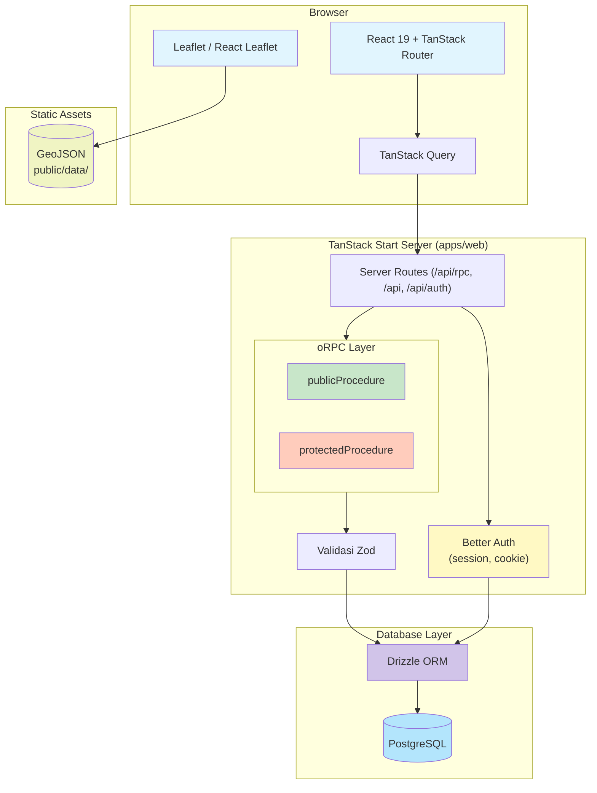

**Sumber:** Source code `lib/orpc/`, `lib/auth/`, `lib/tanstack-query/`, `routes/api/`

---

## Gambar 3.2 — Diagram Struktur Project

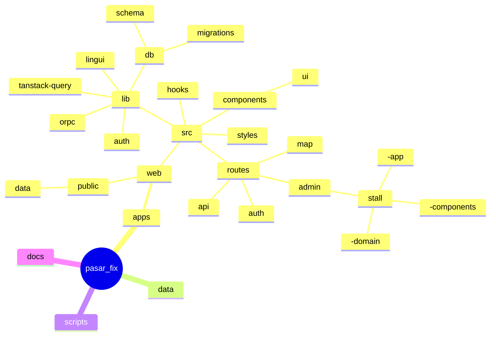

**Sumber:** Struktur folder repository dan `arch.md`

---

## Gambar 3.3 — Entity Relationship Diagram (ERD)

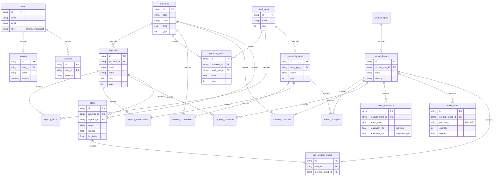

**Sumber:** Schema Drizzle (`auth.ts`, `map-product.ts`, `sale.ts`, `stall.ts`)

---

## Gambar 3.4 — Diagram Login Flow

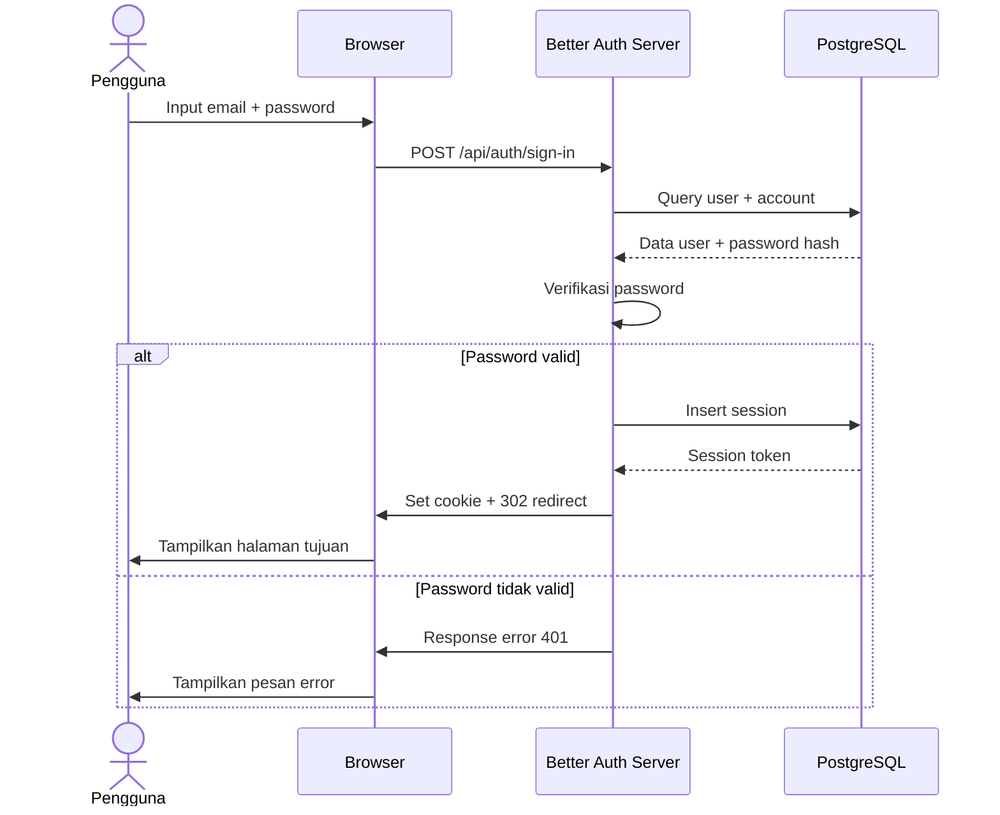

**Sumber:** Konfigurasi Better Auth `lib/auth/index.ts`

---

## Gambar 3.5 — Diagram Authentication & Authorization

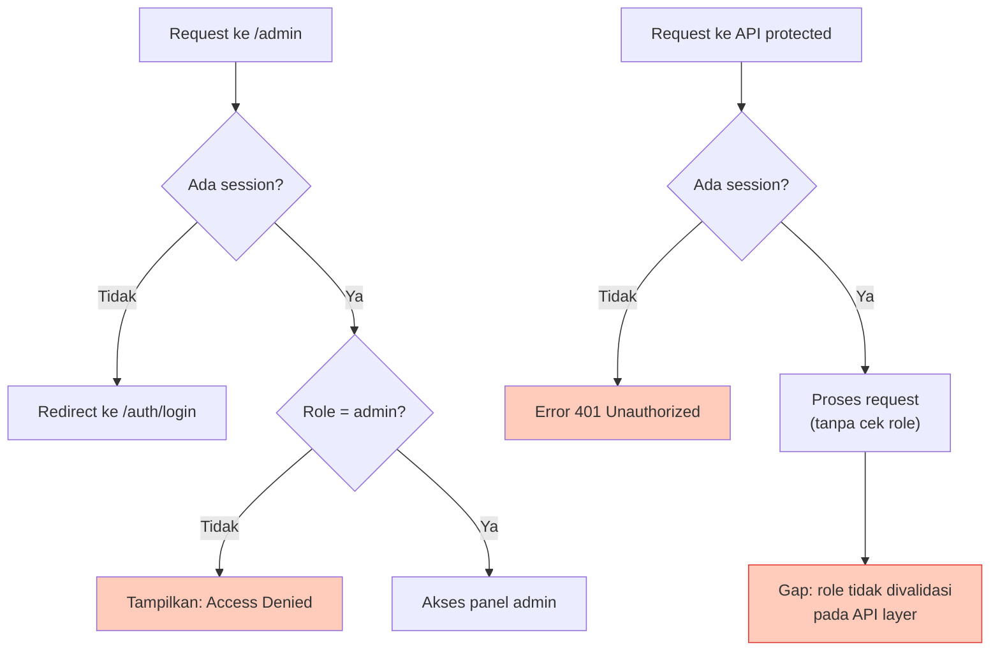

**Sumber:** `routes/admin/route.tsx`, `lib/orpc/index.ts` (protectedProcedure)

---

## Gambar 3.6 — Diagram API Flow (Query & Mutation)

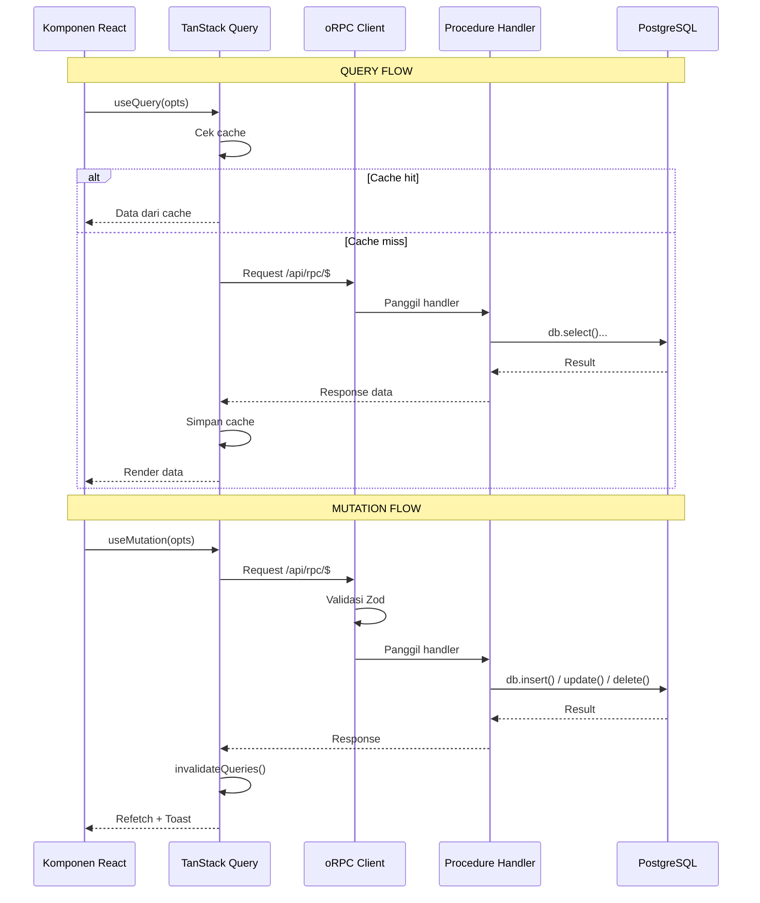

**Sumber:** `lib/orpc/client.ts`, `lib/tanstack-query/`, pola route handler `routes/admin/*/-app/`

---

## Gambar 3.7 — Diagram Modul Province & Regency

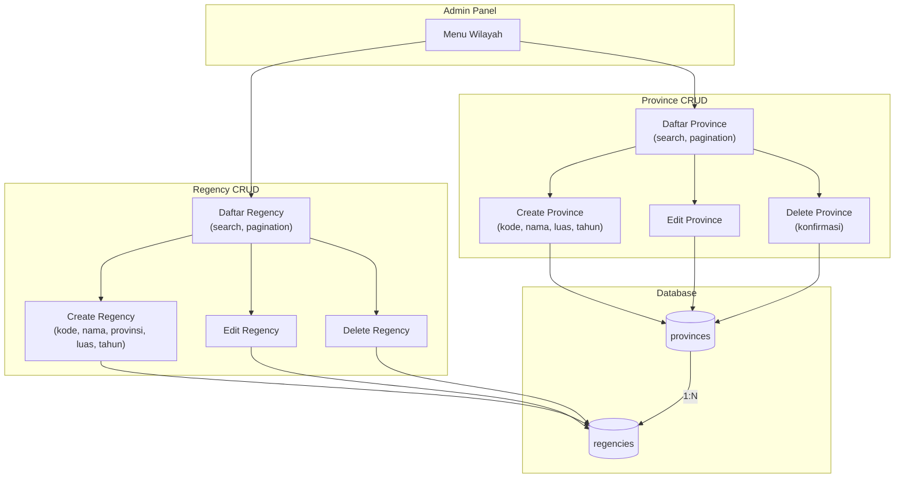

**Sumber:** Endpoint `admin.region.province.*`, `admin.region.regency.*`

---

## Gambar 3.8 — Diagram Modul Commodity

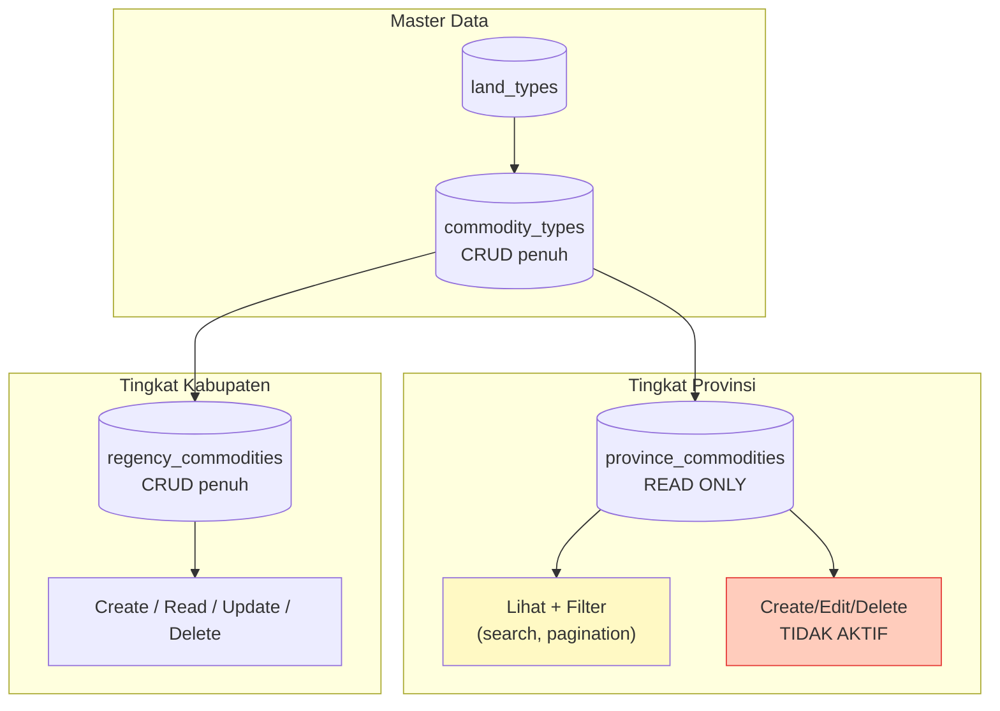

**Sumber:** Endpoint `admin.commodity.*`

---

## Gambar 3.9 — Diagram Product Brand Flow

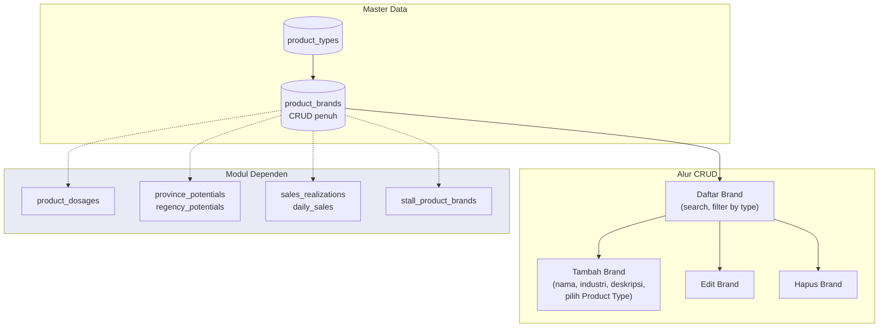

**Sumber:** Endpoint `admin.product.product_brand.*`

---

## Gambar 3.10 — Diagram Product Dosage Flow

```mermaid
flowchart TD
    subgraph Hierarchy["Hierarki Data"]
        PT["Product Type"]
        PB["Product Brand"]
        CT["Commodity Type"]
    end

    subgraph CRUD["CRUD Product Dosage"]
        List["Daftar Dosage\n(per brand)"]
        Create["Tambah Dosage\n(pilih komoditas,\ninput dosis, unit, tahun)"]
        Edit["Edit Dosage"]
        Delete["Hapus Dosage"]
    end

    subgraph DB[("Database")]
        TBL[("product_dosages\ncommodity_type_id FK\nproduct_brand_id FK\ndosage, unit, year")]
    end

    PT --> PB
    PB --> List
    CT --> List
    List --> Create
    List --> Edit
    List --> Delete
    Create --> TBL
    Edit --> TBL
    Delete --> TBL

    style Hierarchy fill:#e1f5fe
```

**Sumber:** Endpoint `admin.product.product_dosage.*`

---

## Gambar 3.11 — Diagram Province Potential Flow

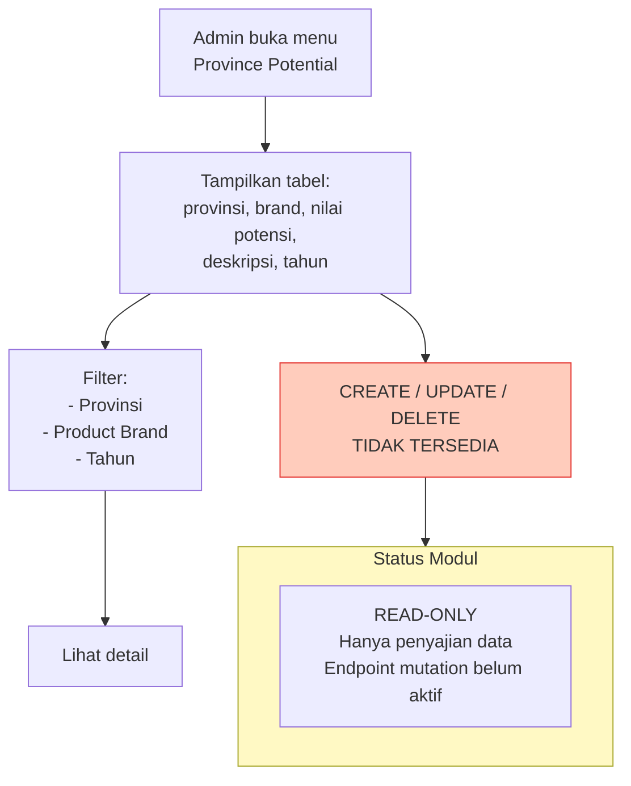

**Sumber:** Endpoint `admin.potential.province_potential.get` (read-only)

---

## Gambar 3.12 — Diagram Sales Realization Flow

```mermaid
flowchart TD
    Start["Admin buka menu\nSales Realization"]
    Filter["Filter:\n- Brand\n- Periode tanggal"]
    Table["Tabel realisasi:\nbrand, tgl laporan, realisasi harian,\nrealisasi bulanan, YTD, RKAP"]
    Pagination["Pagination\n(10/25/50/100)"]

    subgraph CRUD["CRUD Operations"]
        Create["Tambah\n(pilih brand, isi realisasi\n& RKAP)"]
        Edit["Edit"]
        Delete["Hapus"]
    end

    subgraph DB[("Database")]
        TBL[("sales_realizations\nproduct_brand_id FK")]
        Note["Catatan:\nSchema: realization_ytd\nMigration: realizaton_ytd\n[PERLU VERIFIKASI]"]
    end

    Start --> Filter --> Table
    Table --> Pagination
    Table --> Create --> TBL
    Table --> Edit --> TBL
    Table --> Delete --> TBL
    TBL -.-> Note

    style Note fill:#ffccbc,stroke:#e53935
```

**Sumber:** Endpoint `admin.sale.sales_realization.*`

---

## Gambar 3.13 — Diagram Daily Sales Flow

```mermaid
flowchart TD
    Start["Admin buka menu\nDaily Sales"]
    Filter["Filter:\n- Brand\n- Periode tanggal"]
    Table["Tabel penjualan harian:\ntanggal, brand, provinsi,\nqty, revenue, target, realisasi"]
    Pagination["Pagination"]

    subgraph CRUD["CRUD Operations"]
        Create["Tambah\n(pilih brand, provinsi,\ninput qty, revenue, target)"]
        Edit["Edit"]
        Delete["Hapus"]
    end

    subgraph DB[("Database")]
        TBL[("daily_sales\nproduct_brand_id FK\nprovince_id [belum FK]")]
    end

    Start --> Filter --> Table
    Table --> Pagination
    Table --> Create --> TBL
    Table --> Edit --> TBL
    Table --> Delete --> TBL
```

**Sumber:** Endpoint `admin.sale.daily_sales.*`

---

## Gambar 3.14 — Diagram Stall Management Flow

```mermaid
flowchart TD
    Start["Admin buka menu Stall"]

    subgraph CRUD["CRUD DATA KIOS"]
        List["Daftar Stall\n(search, pagination)"]
        Create["Tambah Stall\n(nama, alamat, provinsi,\nkabupaten, lat/lng,\npemilik, noTelp, kriteria)"]
        Edit["Edit Stall"]
        Delete["Hapus Stall\n(konfirmasi)"]
    end

    subgraph Assign["ASSIGNMENT PRODUCT BRAND"]
        Open["Klik 'Products'\npada baris stall"]
        Modal["Modal:\nDaftar semua brand\n+ checkbox"]
        Sync["Simpan → sync\nstall_product_brands"]
        Toast["Toast sukses\n+ refetch"]
    end

    subgraph Import["IMPORT EXCEL"]
        Excel[("File Excel\nSURVEY PASAR KIOS")]
        Script["Script\nseed-stalls.ts"]
        Process["Resolve region\nParse koordinat\nTransaksi insert"]
    end

    subgraph DB[("Database")]
        TStalls[("stalls")]
        TSPB[("stall_product_brands")]
    end

    Start --> CRUD
    List --> Open
    Open --> Modal --> Sync --> Toast
    Sync --> TSPB
    Create --> TStalls
    Edit --> TStalls
    Delete --> TStalls

    Excel --> Script --> Process --> TStalls

    style Assign fill:#e8eaf6
    style Import fill:#e1f5fe
```

**Sumber:** Endpoint `admin.stall.*`, commit `7a38bb7`, `scripts/seed-stalls.ts`

---

## Gambar 3.15 — Diagram Hubungan Survei Lapangan dengan Sistem

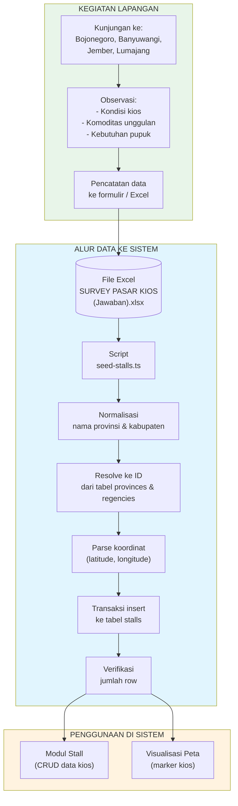

**Sumber:** `data/SURVEY PASAR KIOS (Jawaban).xlsx`, `scripts/seed-stalls.ts`, kegiatan survei lapangan
